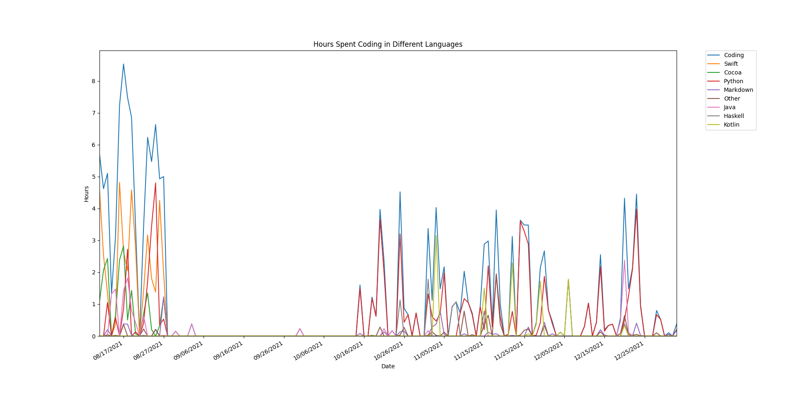

#Waka-Stats
A little program that will plot the different languages I've coded in and the amount of time I've coded in them based off the Waka-Time export JSON. The list of languages included are:
```
Python, Swift, Cocoa, Kotlin, Haskell, Java, Markdown, C++ and "Other"
```
To add a langauge to look for, add it as an environment variable when calling the file, e.g.:
```
python plot.py C C#
```
This would track for C and C# too. <br>
You can click on the interactive legend to show and hide lines. `Middle-Click` to show all the lines and `Right-Click` to hide them all. <br>
Here is an example of my Year in Code for 2021-2022, i.e. from when I was introduced to Waka-Time in August until the New Year:



It will also print out the total statistics in the command line, for example:

```
This data ranges from 2021-08-11 to 2022-01-02
You spent 176 hours 24 minutes coding equalling 2 hours 21 minutes per day
Of which you spent:
        74 hours 28 minutes coding in Python
        39 hours 41 minutes coding in Swift
        17 hours 12 minutes coding in Cocoa
        12 hours 12 minutes coding in Java
        11 hours 26 minutes coding in Kotlin
        7 hours 41 minutes coding in Other
        6 hours 49 minutes coding in Markdown
        5 hours 41 minutes coding in Haskell
The most you coded in one day was: 8 hours 32 minutes
```

You just need to include your own json file from Wakatime and call it `data.json` :)